<br />

<p align="center">
  <a href="https://gitee.com/Z568_568/mango-blog-system.git">
    
  </a>

<h3 align="center">" 🔥 MG'Blog "</h3>
  <p align="center">
    一个 "开箱即用" 个人博客全栈系统项目！
    <br />
    <a href="https://gitee.com/Z568_568/all-blog-sys" target="_blank"><strong>探索本项目的源码 »</strong></a>
    <br />
    <br />
    <a href="http://blog.zhouyi.run/#/" target="_blank"> 👀 前台预览</a>
    ·
    <a href="http://admin.blog.zhouyi.run/#/index" target="_blank"> 👀 管理端预览</a>
</p>

</p>

#### 🥯 小程序预览

  

##### 🥯 QQ群：529675917 由于很多小伙伴对项目的启动安装有问题不明白，可以添加QQ群和大家一起交流解决相关问题哈


#### 🥯 介绍

>  芒果’个人博客系统，包括前后台完整基础功能，小程序，简洁的web前台站点一键配置，响应式；
>  管理端常用增·查·改页面代码自动生成即可，文章统计归档、数据excel批量导入/导出，sql文件已附上，开箱即用，如果对你有帮助，留个 **star⭐⭐** 再走呗
- ⭐项目面向前端学习node.js，mysql等后端基础和小程序学习者
- ⭐有好的建议欢迎交流学习 1840354092@qq.com
- ⭐项目启动安装有问题可以留言，会及时解答

```
   前台：Gblog 
   微信小程序：uniApp + uView 
   管理端：d2-admin 
   Node服务端: express + 数据库ORM（sequelize框架）
```
<!-- PROJECT SHIELDS -->

[](https://gitee.com/Z568_568/all-blog-sys/stargazers)
[](https://gitee.com/Z568_568/all-blog-sys/members)

<!-- PROJECT LOGO -->

#### 其他可能需要的资源 

>[✨Vue3-Antd-Plus基于Vue3、Vite、JavaScript、管理后台完整开发模板](https://gitee.com/Z568_568/vue3-antd-plus.git)

>[ZY.Hexo.Blog响应式简约清爽款个人博客](https://gitee.com/Z568_568/zy-hexo-blog.git)

>[轻量级个人文件管理、图床管理服务系统](https://gitee.com/Z568_568/zy.files.sys.git)

>[node+mongodb开发REST API 的轻量级样板 ✨推荐](https://gitee.com/Z568_568/node.mongodb)

>[node+mysql后端api基础服务模板](https://gitee.com/Z568_568/zy-express-sequelize-mysql)


***

#### 功能列表及更新
- [x] 用户管理
- [x] 菜单管理
- [x] 角色管理 ⛷
- [x] 文章管理
- [x] 评论管理
- [x] 代码生成 ⛷
- [x] 私信邮件回复
- [x] 微信小程序 ⛷
- [x] Excel数据导入/导出 ⛷
- [x] 生成Echart图表 ⛷
- [x] 访客管理记录
- [x] 我的世界
- [x] 🎈博客在线留言（新增）
- [x] 🎈站点管理（新增配置新年灯笼）
- [x] 🎈前台归档管理（新调整）
- [x] 更多请查看示例链接...

#### 更新及修复日志
- [x] ⛏【已修复 2023/04/19】：管理端添加博文不填标签增加失败 
- [x] ⛏【已修复 2023/04/19】：管理端删除菜单的错误
- [x] ⛏【已修复 2023/04/19】：服务端博文标签非空处理 
- [x] ⛏【已修复 2023/04/19】：客户端分类查询不出非推荐文章 
- [x] ⛏【已增加 2023/04/19】：管理端访客页的地址模糊查询
- [x] ⛏【已增加 2023/04/19】：客户端文章详情的相关文章 
- [x] ⛏【已修复 2023/09/04】：访客记录地址解析问题 
- [x] ⛏【已修复 2023/09/04】：文章归档sql
- [x] ⛏ 同学们可以积极提出改进意见哦


#### 接口文档

> 方式1. <a href="https://console-docs.apipost.cn/preview/85df1005c24df829/b25c320b5df19b98" target="_blank"> 👀 查看在线接口文档</a> 


> 方式2. 👀 项目启动后 访问 swagger-ui 接口文档

#### 项目安装启动教程


> [安装启动视频教程](https://www.bilibili.com/video/BV1wY411d7s6/?share_source=copy_web&vd_source=3f6515a9fd6d4dc4f53ed5b3697eaea4)


``` js

1.依赖安装: 微信小程序 mg-mini | 前台client | 管理端admin | 服务端 server -`npm install`

2.启动项目:  前台client- npm run serve 
           前台微信小程序 - HBuilder 编辑器编译-微信小程序运行
           管理端admin - npm run dev 
           服务端 server - nodemon app （热启动） 或者 node app

3.服务端启动前准备: 
            3.1 建库: mg_db  建表:运行sql文件到 mg_db 加载数据表
            3.2 在 mg-server/config/db.config.js 配置数据库信息
            3.3 启动成功示例： 
                    项目启动成功: http://localhost:5222
                    接口文档地址: http://localhost:5222/swagger

4.管理端登录账号密码 ：
            4.1 访客：editor  123456   超级管理员：admin  123456
```
#### 部署项目

可以提供部署本项目的服务 （有偿哦 一杯咖啡的价格）

部署失败全额退款

有需要的同学可以加我微信联系哦！


#### 项目截图

 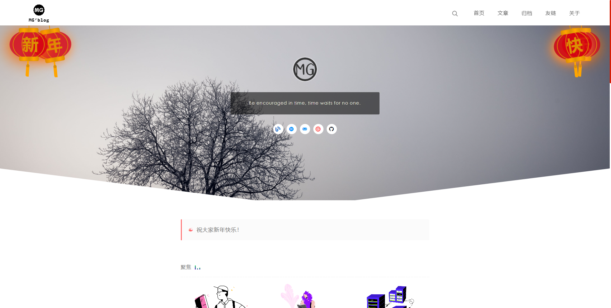
 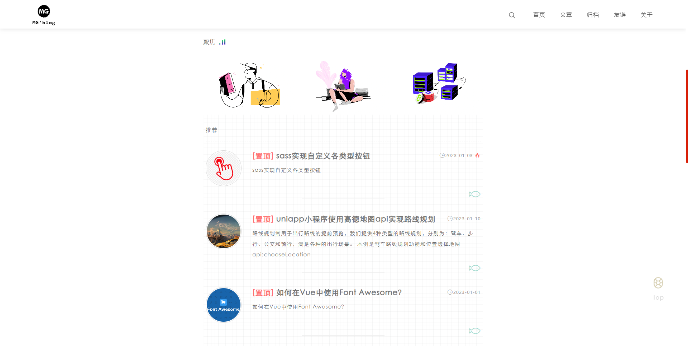
 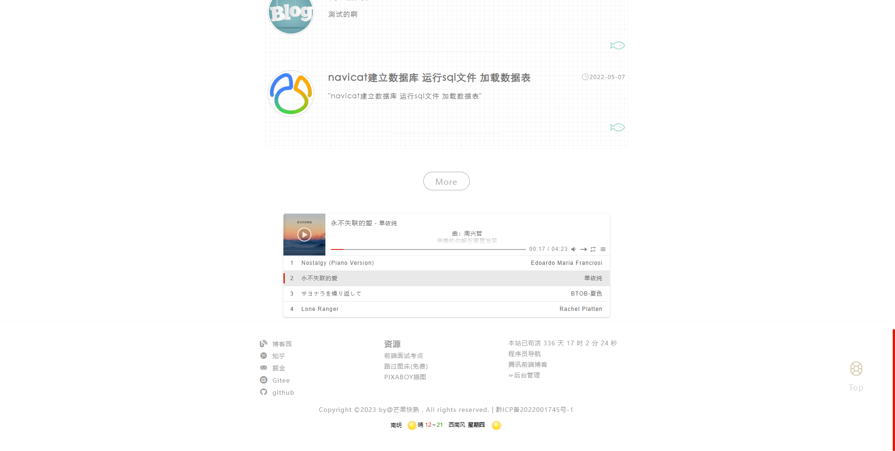
 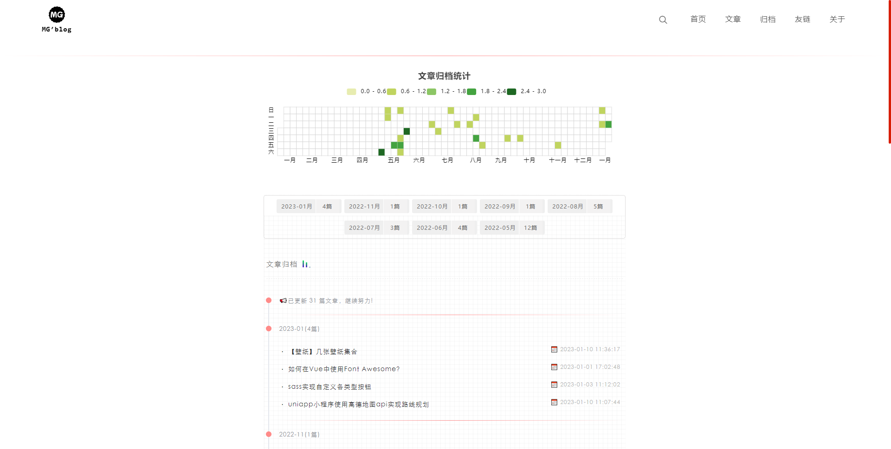
 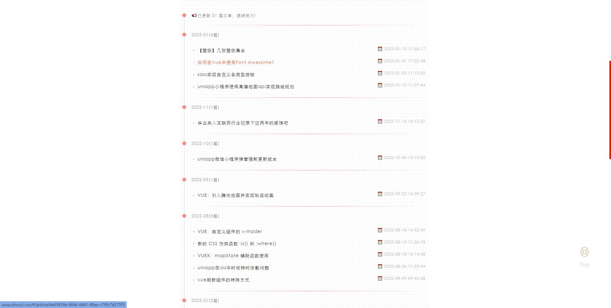
 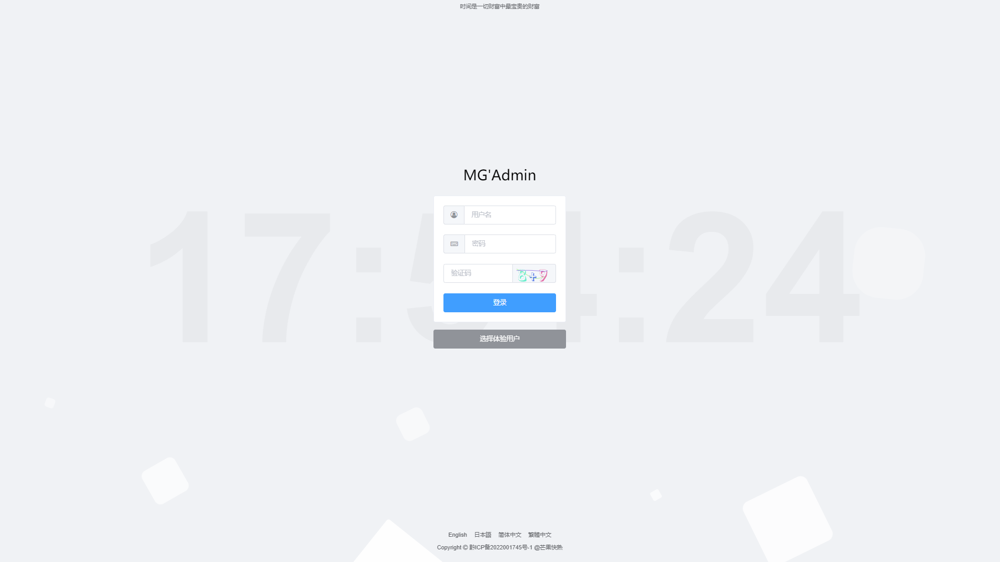
 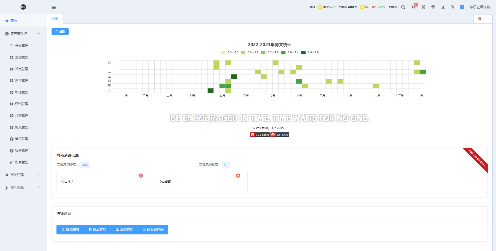
 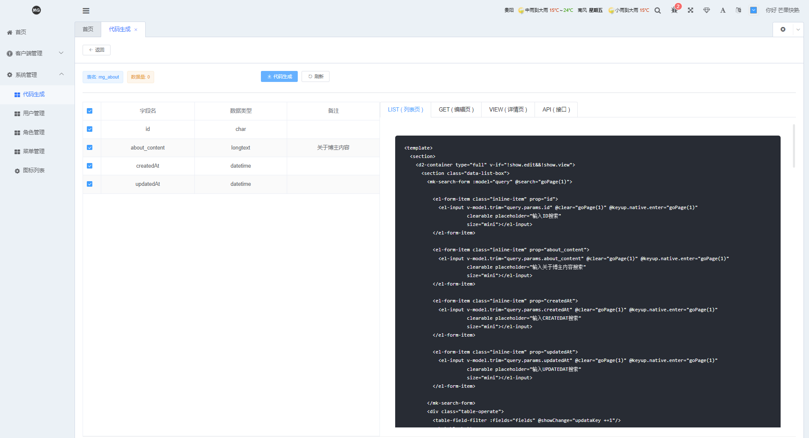
 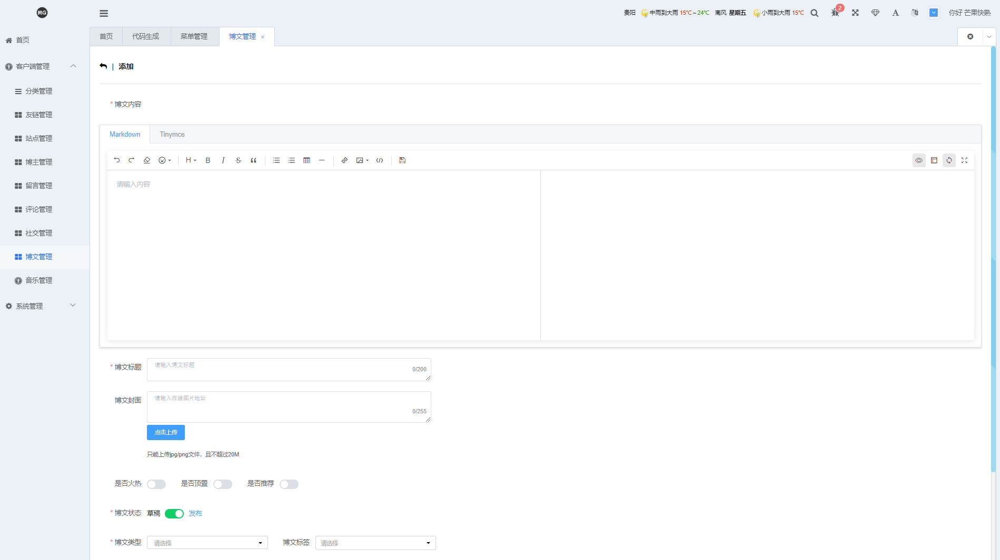
 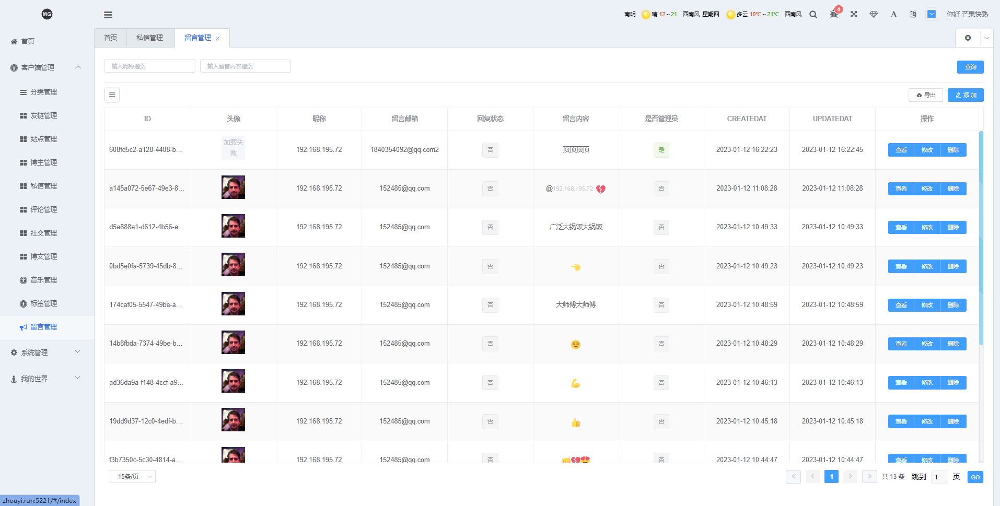
 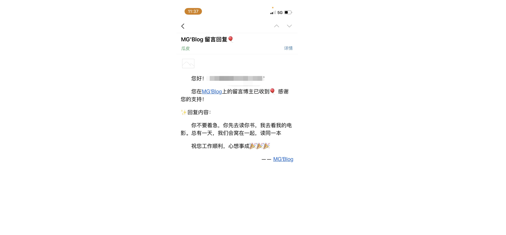

 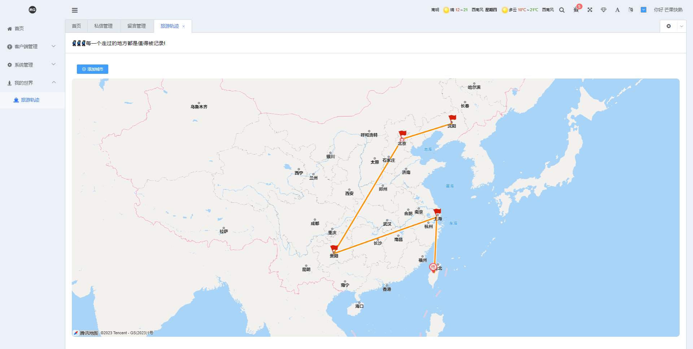
 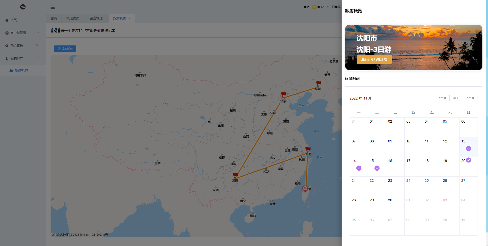
 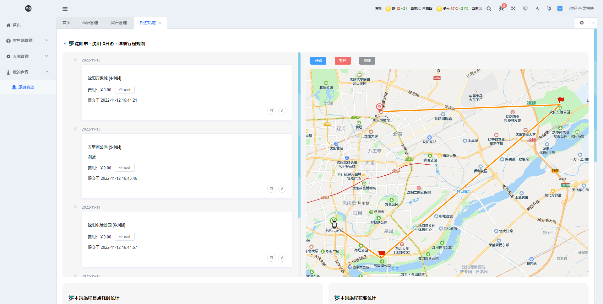

 
 
 
 

####  赞赏作者

 
 
